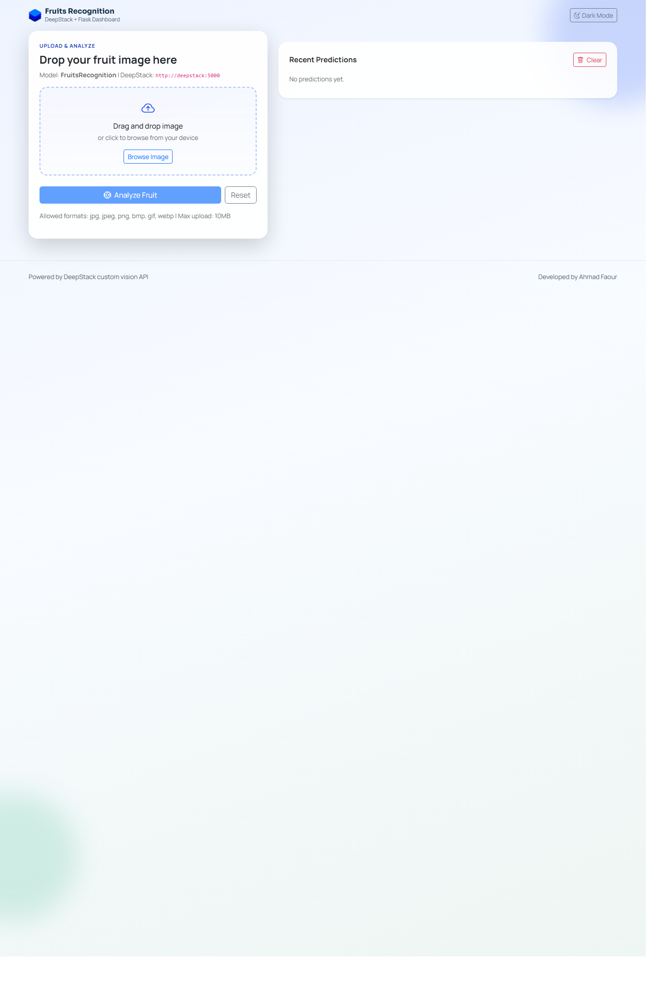
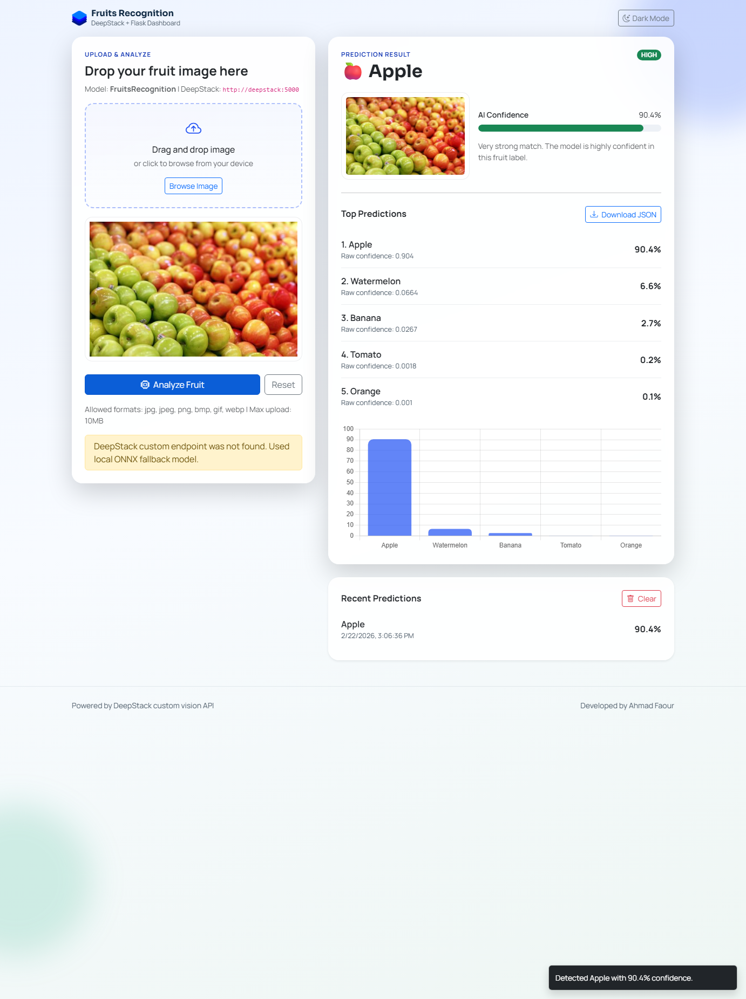

# FruitsRecognitionApp

A modernized Flask + DeepStack fruits classification web app.

This repository is an updated fork of the original project, with Dockerized deployment, UI/UX improvements, and robust fallback inference.

## New UI Screenshots

### Desktop



### Upload Preview (After Image Selection)


### Prediction Result



### Mobile


## Current Status

- Flask app runs on port `81`.
- DeepStack runs on port `5050`.
- Model files are mounted at `modelstore/custom/FruitsRecognition/`.
- If DeepStack custom endpoint returns `404`, the app automatically uses local ONNX fallback (`Fruits.onnx`) via `onnxruntime`.

## Supported Classes

- Apple
- Banana
- Mango
- Orange
- Strawberry
- Tomato
- Watermelon


## What Was Improved

- Modern Bootstrap 5 dashboard UI.
- Drag-and-drop upload with preview.
- Loading state and status alerts.
- Confidence progress bar and color-coded confidence level.
- Top-N predictions list and probability chart.
- Prediction history in browser local storage.
- Download prediction output as JSON.
- Dark mode toggle.
- Structured backend API responses (`/api/predict`).
- Better DeepStack error handling and logging.
- Local ONNX fallback for environments where `/v1/vision/custom/<model>` is unavailable.
- Dockerfile + Docker Compose setup for one-command run.
- Updated test script (`test`) with fallback-aware validation.

## Project Structure

```text
.
|-- app.py
|-- Dockerfile
|-- docker-compose.yml
|-- requirements.txt
|-- config.json
|-- Fruits.onnx
|-- test
|-- modelstore/
|   `-- custom/
|       `-- FruitsRecognition/
|           |-- Fruits.onnx
|           `-- config.json
|-- utils/
|   |-- deepstack_client.py
|   `-- local_onnx.py
|-- templates/
|   `-- index.html
`-- static/
    |-- css/style.css
    |-- js/actions.js
    `-- img/
```

## Run With Docker Compose (Recommended)

### Prerequisites

- Windows with Docker Desktop installed.

### Start

```bash
docker compose up --build -d
```

### Verify

```bash
docker compose ps
```

Open:

- App: http://localhost:81
- DeepStack: http://localhost:5050

Health check:

```bash
curl http://localhost:81/api/health
```

### Stop

```bash
docker compose down
```

## Run Locally (Without Docker for Flask)

1. Install dependencies:

```bash
pip install -r requirements.txt
```

2. Start DeepStack container:

```bash
docker run --name deepstack -p 5050:5000 -v "<PROJECT_PATH>\\modelstore:/modelstore" deepquestai/deepstack
```

3. Run Flask app:

```bash
python app.py
```

## API Endpoints

- `GET /api/health`
- `POST /api/predict` (multipart form-data with field name: `file`)
- `POST /submit` (backward-compatible alias to `/api/predict`)

## Environment Variables

- `DEEPSTACK_BASE_URL` (default: `http://localhost:5050`)
- `DEEPSTACK_MODEL_NAME` (default: `FruitsRecognition`)
- `DEEPSTACK_TIMEOUT_SECONDS` (default: `45`)
- `ENABLE_LOCAL_ONNX_FALLBACK` (default: `true`)
- `MAX_UPLOAD_MB` (default: `10`)
- `PORT` (default: `81`)
- `LOG_LEVEL` (default: `INFO`)

## Test Script

Run:

```bash
python test
```

Behavior:

1. Ensures model is registered in DeepStack (`/v1/vision/listmodels` and `/v1/vision/addmodel` if needed).
2. Tries DeepStack custom endpoint.
3. If custom endpoint returns `404`, it validates Flask `/api/predict` fallback path.

A `404` followed by successful Flask prediction is expected with some DeepStack builds.

## DeepStack Compatibility Note

With `deepquestai/deepstack` version `2022.01.01`, custom route `/v1/vision/custom/<model>` may not be available for this ONNX model flow even when the model is listed successfully.

In this project, that case is handled automatically by local ONNX fallback so the application remains usable.

## Confidence Score Note

Model confidence is not a guarantee of absolute truth. Displayed `100%` can happen due to score saturation/rounding and should be interpreted as very high confidence, not perfect certainty.

## Publish This Fork To GitHub

If your remote is already configured:

```bash
git add .
git commit -m "Update app, Docker setup, fallback inference, UI, and docs"
git push
```

If you want to push to a new repository:

```bash
git remote -v
git remote set-url origin <YOUR_NEW_REPO_URL>
git add .
git commit -m "Update app, Docker setup, fallback inference, UI, and docs"
git push -u origin main
```
